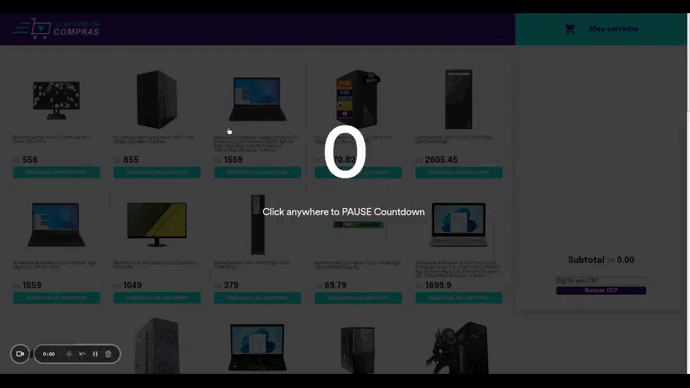

# 🛒 Shopping Cart Project

  

## 📝 About this Project

This was a project carried out jointly with Trybe, a developer professionalizing company. With the design offered by them, I developed functions and tests that simulate the steps of an online purchase. A "Mercado Livre" API was used to fetch product data and a CEP API to get an address.

> Deploy: https://shooping-cart-project.vercel.app/

## 🌐 Overview:

##### User must be able to:

> Add and remove an item to the cart

> Search for a zip code and receive the address on the screen

> Check that the data when refreshing the page is saved in localStorage

> Values update when adding or removing an item

##### Improvements:

In this application, it is possible to continue development by applying new pages to finalize the purchase process, deliver new elements with better user experience, consume other APIs. 

> The focus of the application was the consumption of APIs and the display of data on the screen. Little was looked into the CSS itself.

## 🛜 Installing the repository on your machine

```js
git clone git@github.com:douglasbacelar/shooping-cart-project.git
npm install
```
## 🧪 Running the coverage tests

```js
npm run test-coverage
```

## 🔧 Tools and Methodologies Used

> HTML5 Semântico

> CSS

> JavaScript

> Consumo de API

## 💻 Author

Desenvolvido por [Douglas Bacelar](https://www.linkedin.com/in/douglas-bacelar-82b722149)
